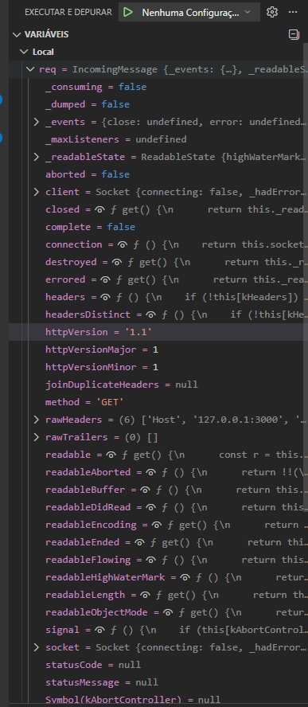

- O curl fica pendurado. O debugger pausou a thread, então o event loop parou
  e ninguém chama res.end(). Mesmo efeito do while do Ex 05: thread parada,
  requisição na fila.

- Quando você não sabe o que procurar. Com breakpoint dá pra abrir o req inteiro
  e navegar pelos campos; com console.log você precisa já saber o nome do campo
  antes de logar. Também mostra a pilha de chamadas — quem chamou aquela função.